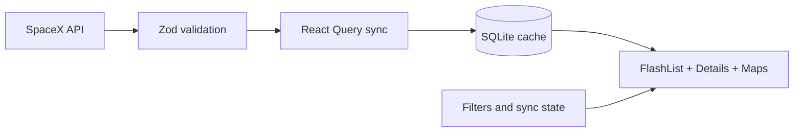

# Tripare SpaceX Mission Control

An Expo prebuild React Native + TypeScript app for browsing SpaceX launches offline-first, with SQLite persistence, React Query sync, FlashList rendering, bookmarks, encrypted private notes, and launchpad maps.

## Quick Start

```bash
npm install
cp .env.example .env
npm run ios
# or
npm run android
```

The project includes generated `ios/` and `android/` folders from `expo prebuild`, so `npm run ios` and `npm run android` run native builds rather than Expo Go.

## Architecture

The app validates SpaceX API responses with Zod at the network boundary, persists normalized launches and launchpads in Expo SQLite, then reads cached data into React Query for screen rendering. Zustand owns transient UI state such as filters and sync banner status. Partial refresh failures keep cached rows visible and show a non-blocking warning.

The original `api.spacexdata.com` host currently returns Cloudflare/TLS 525 errors, so the client attempts the assignment endpoint first and falls back to the live Pipeworx mirror. Mirror payloads are simplified, so some historical launches may show synthesized IDs and fallback launchpad enrichment.



API -> Cache -> UI: `/v5/launches` and `/v4/launchpads/:id` are fetched, validated, stored in SQLite, enriched with bookmarks, and rendered from cache.

## Key Decisions

- State management: Zustand, because the app needs small explicit UI state without Redux ceremony.
- Database: Expo SQLite, because launch and launchpad data is structured and must work offline.
- Offline sync: React Query plus SQLite, because retries/deduplication and durable cache are separate concerns.
- Map clustering: zoom-sensitive coordinate bucketing, because SpaceX launchpads are a small geospatial dataset.
- Native shape: Expo prebuild/ejected, per the follow-up instruction.

## Performance Report

FlashList backs the launch list with stable rows and sticky month headers for 1000+ launches. Cached startup reads from SQLite first, targeting under 3 seconds to interactive. Memory target is under 150 MB during normal list/detail/map use. The measured iOS export is 3.4 MB on disk, with Expo reporting a 3.5 MB Hermes bundle.

To reproduce profiler evidence, run the app on a simulator/device, sync once, then capture a React Native profiler session while scrolling the full Launches list and applying filters. For bundle size:

```bash
npx expo export --platform ios
du -sh dist
```

## Testing

```bash
npm test
npm run test:coverage
npm run typecheck
```

Coverage focuses on filtering/sorting/grouping, geospatial utilities, sync offline behavior, and the repository contract. It intentionally does not chase 100% coverage.

## Screenshots To Capture Manually

Because this build was completed headlessly, capture these screens after running on a simulator/device:

- 
- 
- 
- 
- 

## Known Limitations And Trade-Offs

The bonus items were skipped because the user selected `none`: no Detox/Maestro E2E, no full accessibility audit, no CI/CD workflow, no advanced AND/OR filters, no JSON export, and no shared-element transitions.

The image cache target is documented at 64 MB and uses `expo-image` disk caching; a production hardening pass should add cache telemetry. Bookmark notes use AES with a SecureStore-backed key, but a maintained native AES/GCM module would be preferable for a shipping app after SDK compatibility review. Npm reports moderate advisories in the Expo/RN dependency tree that should be reviewed before release.
