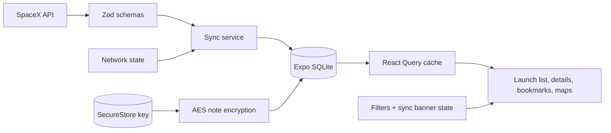

# Architecture

Tripare SpaceX Mission Control is an Expo prebuild React Native app written in strict TypeScript. The app uses React Navigation for typed routing, React Query for refresh orchestration and request deduplication, Zustand for lightweight UI/session state, and Expo SQLite as the durable offline store for launches, launchpads, metadata, and bookmarks.

## Data Flow

1. `syncMissionData` checks connectivity with NetInfo and migrates SQLite.
2. When online, it fetches `/v5/launches`, validates through Zod, enriches unique launchpads through `/v4/launchpads/:id`, and writes both datasets transactionally.
3. When offline or partially failed, the UI reads the last successful SQLite snapshot and displays a non-blocking banner.
4. React Query deduplicates concurrent screen requests and retries failed sync attempts with exponential backoff.
5. Launch list filtering and grouping happen in memory over normalized cached objects for fast repeated UI changes.

## Storage Schema

`launches` stores normalized launch records and JSON-encoded payload IDs. `launchpads` stores geospatial enrichment keyed by launchpad ID. `bookmarks` stores bookmark state and encrypted notes. `metadata` stores sync timestamps and future migration values. The current migration creates indexes for date and name because those are the primary list sort/search axes.

## Screens

The main navigator has Launches, Bookmarks, and Launchpads tabs. Launches renders a FlashList-backed flattened section model with sticky month headers. Details has Overview, Launchpad, and Media tabs. Launchpad maps request when-in-use location permission, show pad markers without blocking on denial, and open native map directions through platform linking.
